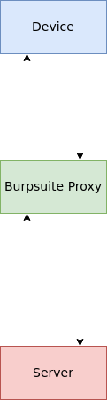
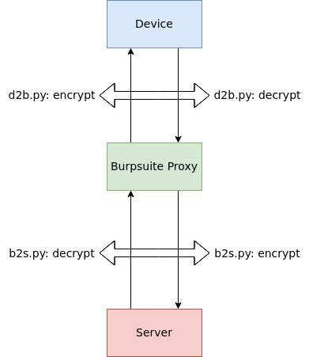

## proPyTree -> proxy under Python proprieTree

### Problem Statement

While performing the `Traffic Analysis` part of Mobile (Android/iOS) Application Penetration Testing and also during Web Application Penetration Testing, we sometimes observe that some or all of the request and/or response parameters are encrypted. This does not allow us to peek into the clear text requests and/or responses using a proxy tool like Burpsuite.

We need a way out in which we have full or maximum control over the modification of request and response parameters. 

### Introducing MiTM Proxy

[MitmProxy](https://mitmproxy.org/) is one of the famous tools which gives us a lot of control over requests and responses. We can make use of its features to accomplish our tasks in a very easy and rapid manner.

### Understanding the flow

When we connect our device (any platform- Android, iOS or Web Browser) to Burpsuite for traffic analysis, we observe the following in the normal scenario:

1. Device issues an HTTP(s) request to the server.
2. The request is intercepted by Burp and is shown in readable form on tools like Proxy, Repeater and the Intruder.
3. Burp issues the request to the server.
4. The server receives the request and generates a response for the application on the device.
5. The response is intercepted by Burp and is shown in a readable form.
6. Burp issues the response to the application/device. 

Here comes Encryption and the solution through MitmProxy.

We will have two MitmProxies running on different ports of our laptop/desktop machine.

1. Device issues an encrypted HTTP(s) request to the server.
2. Our first MitmProxy intercepts the request.
3. The first MitmProxy uses the python file `d2b.py` to decrypt the request parameters and forward the request to its upstream proxy server i.e. Burp. 
4. Burp shows us the request parameters in plain text, where we can perform our tampering and let the request go forward to another upstream proxy server i.e our second Mitmproxy.
5. The second MitmProxy uses the python file `b2s.py` to encrypt the request parameters in a way that the server the expecting the request.
6. The server receives the request and generates a response for the application on the device.
7. The response is intercepted by our second MitmProxy which receives the encrypted response.
8. The second MitmProxy uses the python file `b2s.py` to decrypt the request parameters and sends the response to Burp.
9. Burp intercepts the response and allows users to tamper with the response parameters before sending it ahead.
10. The response is intercepted by our first MitmProxy which is decrypted currently.
11. The first MitmProxy uses the python file `d2b.py` to encrypt the response parameters and forwards the response to the device.
12. The device finally receives the encrypted response which can be used further to perform actions as per the application's configuration. 

### Setup

 1. Install the requirements:
    
    `pip3 install -r requirements.txt`
    
    and in some cases...
    `pip3 install -r requirements.txt --user` 

 2. Read the comments in the file `d2b.py` and execute it on the command line.
 For example, `mitmdump -k -p 8081 -m upstream:http://127.0.0.1:8888 -s d2b.py`
 *Note:* The above command would try to start a proxy server at port number `8081`.
 If you would like to change the port number, you can do so by changing the value after `-p` switch. 

 3. Do the same with the file `b2s.py`.
 For example, `mitmdump -k -p 8082 -m regular -s b2s.py`.
 

### Changes to be made

The default behavior of our setup does nothing but routing the network traffic properly between our proxies and Burp.

To get something out of this, the following things need to be done:

1. Proper study and the observation of the encryption/decryption taking place. This is done by understanding the client-side code i.e
   - Javascript for Web Applications
   - Java or any other programming language used by the Android application
   - Reverse Engineering of the iOS application binary
2. Modifying the `encrypt` and `decrypt` functions as per point #1.
3. Modifying the `request` and `response` functions ad per point #1.

### Further thoughts

Security Researchers all over the world using this repository are recommended to share their experience with all of us for additions and improvements.
